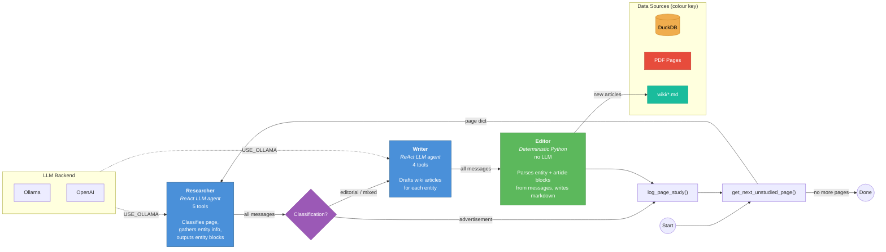
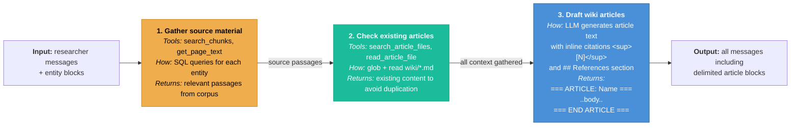
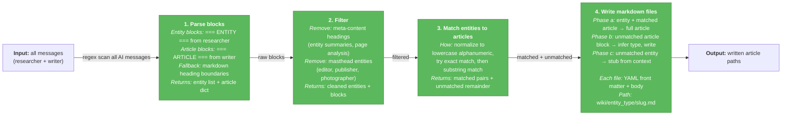

# DocSwarm Process Flow

## High-Level Pipeline

---

## Researcher (detail)

The researcher runs as a **single ReAct LLM invoke()** — the LLM autonomously decides which tools to call and in what order. The steps below are the typical sequence.

```mermaid
flowchart LR
    IN["<b>Input:</b> page text,<br/>image path, metadata"]

    IN --> S1

    S1["<b>1. Classify page</b><br/><i>Tool:</i> classify_page_content<br/><i>How:</i> page image + OCR text &rarr; vision LLM<br/><i>Returns:</i> editorial / advertisement / mixed"]

    S1 -->|"advertisement"| OUT_AD["<b>Output:</b> classification only<br/>(LLM stops, no entities)"]
    S1 -->|"editorial / mixed"| S2

    S2["<b>2. Read page content</b><br/><i>Tools:</i> get_page_text, search_chunks<br/><i>How:</i> SQL queries on chunks table<br/><i>Returns:</i> full OCR text + relevant chunks"]

    S2 -->|"page text + chunks"| S3

    S3["<b>3. Identify entities</b><br/><i>How:</i> LLM reads text, identifies<br/>people, places, organisations, events,<br/>objects, concepts<br/><i>Returns:</i> candidate entity list with types"]

    S3 -->|"entity names + types"| S4

    S4["<b>4. Check existing articles</b><br/><i>Tool:</i> search_article_files<br/><i>How:</i> glob + read wiki/*.md<br/><i>Returns:</i> which entities already<br/>have articles vs need new ones"]

    S4 --> S5

    S5["<b>5. Output entity blocks</b><br/><i>How:</i> LLM outputs structured<br/>=== ENTITY: Name (type) ===<br/>facts + sources<br/>=== END ENTITY ===<br/><i>Returns:</i> entity:info pairs in messages"]

    S5 --> OUT["<b>Output:</b> messages with classification<br/>+ entity blocks (no DB writes)"]

    %% Styling
    classDef srcDb fill:#f0ad4e,stroke:#c77f1a,color:#000
    classDef srcWiki fill:#1abc9c,stroke:#16a085,color:#fff
    classDef srcMixed fill:#e74c3c,stroke:#f0ad4e,color:#fff,stroke-width:4px
    classDef srcLlm fill:#4a90d9,stroke:#2c5f8a,color:#fff
    classDef srcStop fill:#999,stroke:#666,color:#fff

    class S1 srcMixed
    class S2 srcDb
    class S3 srcLlm
    class S4 srcWiki
    class S5 srcLlm
    class OUT_AD srcStop
```

---

## Writer (detail)

The writer also runs as a **single ReAct LLM invoke()**, receiving the full message history from the researcher.

---

## Editor (detail)

The editor is **deterministic Python** — no LLM calls. It receives the full message history and writes files to disk.

---

## Summary Tables

| Stage | Type | Tools | Input | Output |
|-------|------|-------|-------|--------|
| **Researcher** | ReAct LLM | 5 | Page text + image | Classification + entity blocks in messages |
| **Router** | Deterministic | 0 | ToolMessage from classify | `"writer"` or `END` |
| **Writer** | ReAct LLM | 4 | Researcher messages | `=== ARTICLE ===` delimited blocks |
| **Editor** | Deterministic Python | 0 | All messages (entity + article blocks) | Markdown files in `wiki/` |

### Researcher Tools (5)

| Tool | Source | Purpose |
|------|--------|---------|
| `classify_page_content` | PDF image + OCR | Determine if page is ad/editorial/mixed |
| `search_chunks` | DuckDB | Find text chunks matching a query |
| `get_page_text` | DuckDB | Get full OCR text for a page |
| `list_documents` | DuckDB | List available documents |
| `search_article_files` | wiki/*.md | Check if an article already exists |

### Writer Tools (4)

| Tool | Source | Purpose |
|------|--------|---------|
| `search_chunks` | DuckDB | Find supporting text passages |
| `get_page_text` | DuckDB | Get full OCR text for a page |
| `search_article_files` | wiki/*.md | Check existing articles |
| `read_article_file` | wiki/*.md | Read an existing article's content |

### LLM Backend

Controlled by `USE_OLLAMA` env var:

| Setting | Agent LLM | Classification |
|---------|-----------|---------------|
| `USE_OLLAMA=true` | `ChatOllama` (local) | Raw `/api/generate` with vision |
| `USE_OLLAMA=false` | `ChatOpenAI` | OpenAI chat completions with vision |
