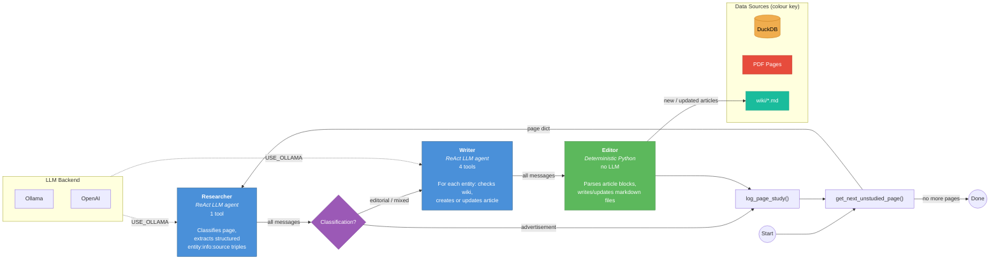
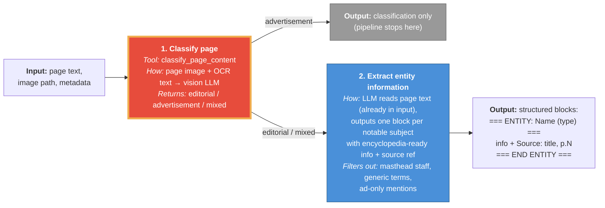
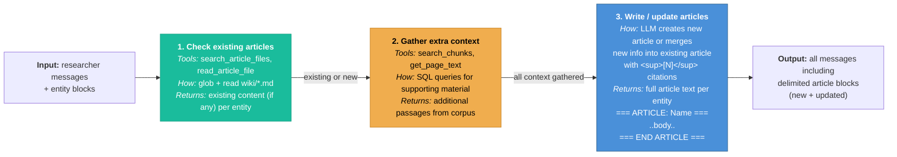

# DocSwarm Process Flow

## High-Level Pipeline

---

## Researcher (detail)

The researcher runs as a **single ReAct LLM invoke()**. It has one tool (`classify_page_content`) and the page text is already in the input message. After classification, it reads the page text and outputs structured entity:info:source blocks — no database reads or writes.

---

## Writer (detail)

The writer runs as a **single ReAct LLM invoke()**, receiving the full message history from the researcher (including entity blocks). For each entity, the writer decides whether to **create** a new article or **update** an existing one.

---

## Editor (detail)

The editor is **deterministic Python** — no LLM calls. It receives the full message history and writes files to disk. It can both create new files and overwrite existing ones (for updates from the writer).

---

## Summary Tables

| Stage | Type | Tools | Input | Output |
|-------|------|-------|-------|--------|
| **Researcher** | ReAct LLM | 1 | Page text + image | Classification + entity:info:source blocks |
| **Router** | Deterministic | 0 | ToolMessage from classify | `"writer"` or `END` |
| **Writer** | ReAct LLM | 4 | Researcher messages + entity blocks | `=== ARTICLE ===` blocks (new + updated) |
| **Editor** | Deterministic Python | 0 | All messages (entity + article blocks) | Markdown files in `wiki/` |

### Researcher Tools (1)

| Tool | Source | Purpose |
|------|--------|---------|
| `classify_page_content` | PDF image + OCR | Determine if page is ad/editorial/mixed |

### Writer Tools (4)

| Tool | Source | Purpose |
|------|--------|---------|
| `search_article_files` | wiki/*.md | Check if an article already exists |
| `read_article_file` | wiki/*.md | Read existing article content (for updates) |
| `search_chunks` | DuckDB | Find supporting text passages |
| `get_page_text` | DuckDB | Get full OCR text for a page |

### LLM Backend

Controlled by `USE_OLLAMA` env var:

| Setting | Agent LLM | Classification |
|---------|-----------|---------------|
| `USE_OLLAMA=true` | `ChatOllama` (local) | Raw `/api/generate` with vision |
| `USE_OLLAMA=false` | `ChatOpenAI` | OpenAI chat completions with vision |
