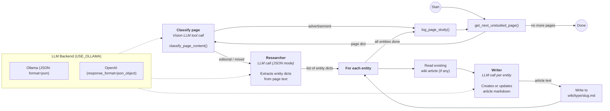
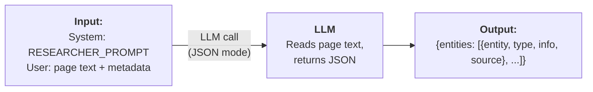
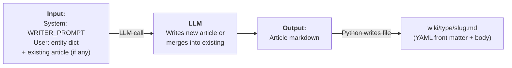

# DocSwarm Process Flow

## High-Level Pipeline



---

## Researcher (detail)

A single LLM call in **JSON mode** — no tools, no agents. The page text is already in the input message.



Example output:
```json
{
  "entities": [
    {
      "entity": "Reg Harris",
      "type": "person",
      "info": "British track cycling champion who won multiple world sprint titles.",
      "source": "Cycling Weekly Vol.12, p.3"
    }
  ]
}
```

---

## Writer (detail)

Called **once per entity** in a loop. Receives the entity dict from the researcher plus any existing article content.



---

## Summary

| Step | Type | Input | Output |
|------|------|-------|--------|
| **Classify** | Tool call (vision LLM) | Page image + OCR | `advertisement` / `editorial` / `mixed` |
| **Researcher** | LLM (JSON mode) | Page text | `{entities: [{entity, type, info, source}]}` |
| **Writer** (per entity) | LLM | Entity dict + existing article | Article markdown |
| **File write** | Python | Article text | `wiki/type/slug.md` |

### LLM Backend

Controlled by `USE_OLLAMA` env var:

| Setting | Researcher JSON mode | Writer | Classification |
|---------|---------------------|--------|----------------|
| `USE_OLLAMA=true` | `ChatOllama(format="json")` | `ChatOllama` | Raw `/api/generate` with vision |
| `USE_OLLAMA=false` | `ChatOpenAI(response_format=json_object)` | `ChatOpenAI` | OpenAI chat completions with vision |
