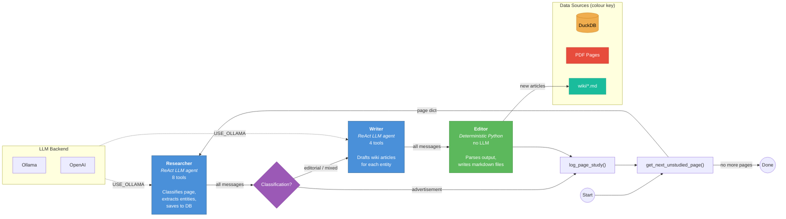
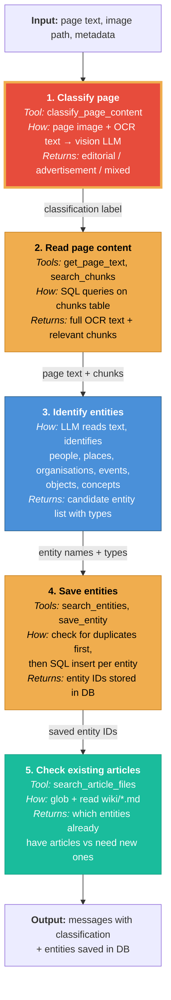
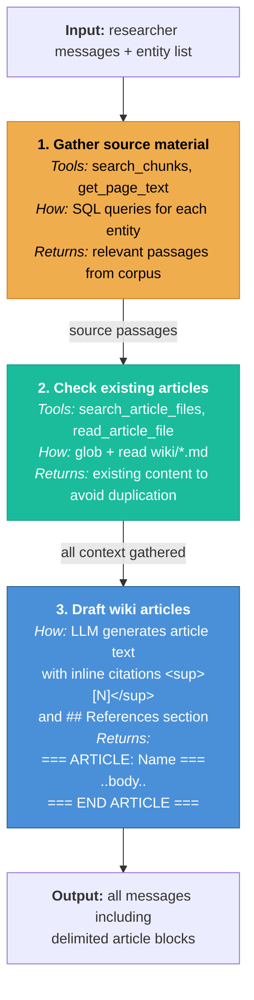
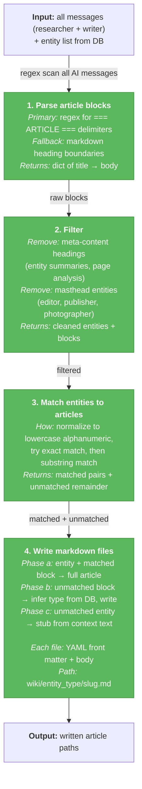

# DocSwarm Process Flow

## High-Level Pipeline

---

## Researcher (detail)

The researcher runs as a **single ReAct LLM invoke()** — the LLM autonomously decides which tools to call and in what order. The steps below are the typical sequence.

---

## Writer (detail)

The writer also runs as a **single ReAct LLM invoke()**, receiving the full message history from the researcher.

---

## Editor (detail)

The editor is **deterministic Python** — no LLM calls. It receives the full message history and writes files to disk.

---

## Summary Tables

| Stage | Type | Tools | Input | Output |
|-------|------|-------|-------|--------|
| **Researcher** | ReAct LLM | 8 | Page text + image | Classification + entities in DB |
| **Router** | Deterministic | 0 | ToolMessage from classify | `"writer"` or `END` |
| **Writer** | ReAct LLM | 4 | Researcher messages | `=== ARTICLE ===` delimited blocks |
| **Editor** | Deterministic Python | 0 | All messages + DB entities | Markdown files in `wiki/` |

### LLM Backend

Controlled by `USE_OLLAMA` env var:

| Setting | Agent LLM | Classification |
|---------|-----------|---------------|
| `USE_OLLAMA=true` | `ChatOllama` (local) | Raw `/api/generate` with vision |
| `USE_OLLAMA=false` | `ChatOpenAI` | OpenAI chat completions with vision |
