# DocSwarm Process Flow

```mermaid
flowchart TD
    subgraph KEY["Data Sources (colour key)"]
        direction LR
        DB[(DuckDB/DuckLake<br/>documents, pages,<br/>chunks, entities)]
        PDF["Scanned PDF Pages<br/>(images + OCR text)"]
        WIKI_IN["wiki/*.md<br/>(existing articles)"]
    end

    KEY ~~~ START
    START((Start)) --> NEXT["get_next_unstudied_page()"]
    NEXT -->|"page dict<br/>(id, raw_text, image_path)"| R

    subgraph LLM_BACKEND["LLM Backend (configurable)"]
        direction LR
        OLLAMA["Ollama<br/>qwen3.5:4b / gemma3:4b"]
        OPENAI["OpenAI<br/>gpt-5.4-nano"]
    end

    subgraph RESEARCHER["Researcher Agent (ReAct LLM)"]
        R["Receive page text + metadata"]

        R -->|"LLM emits<br/>tool call"| R_CLASSIFY

        R_CLASSIFY["<b>1. Classify page</b><br/><i>Tool:</i> classify_page_content<br/><i>How:</i> sends page image + OCR text<br/>to vision LLM<br/><i>Returns:</i> editorial / advertisement / mixed"]

        R_CLASSIFY -->|"classification<br/>label"| R_EXTRACT

        R_EXTRACT["<b>2. Read page text</b><br/><i>Tools:</i> get_page_text, search_chunks<br/><i>How:</i> SQL queries on chunks table<br/><i>Returns:</i> full OCR text + matching chunks"]

        R_EXTRACT -->|"page text +<br/>chunk results"| R_IDENTIFY

        R_IDENTIFY["<b>3. Identify entities</b><br/><i>How:</i> LLM reads text, picks out<br/>people, places, organisations, events<br/><i>Returns:</i> candidate entity list"]

        R_IDENTIFY -->|"entity names<br/>+ types"| R_SAVE

        R_SAVE["<b>4. Save entities</b><br/><i>Tools:</i> save_entity, search_entities<br/><i>How:</i> SQL insert per entity;<br/>checks for duplicates first<br/><i>Returns:</i> entity IDs in database"]

        R_SAVE -->|"saved entity<br/>IDs + names"| R_CHECK

        R_CHECK["<b>5. Check existing articles</b><br/><i>Tool:</i> search_article_files<br/><i>How:</i> glob + read wiki/*.md<br/><i>Returns:</i> which entities already<br/>have wiki articles"]
    end

    R_CHECK -->|"read ToolMessage<br/>from step 1"| ROUTE{"Route:<br/>page classification?"}
    ROUTE -->|"advertisement"| SKIP["Skip page"]
    SKIP --> MARK
    ROUTE -->|"editorial / mixed"| W

    subgraph WRITER["Writer Agent (ReAct LLM)"]
        W["Receive researcher messages + entity list"]

        W -->|"LLM emits<br/>tool call"| W_READ

        W_READ["<b>1. Gather source material</b><br/><i>Tools:</i> search_chunks, get_page_text<br/><i>How:</i> SQL queries for each entity<br/><i>Returns:</i> relevant passages"]

        W_READ -->|"source<br/>passages"| W_SEARCH

        W_SEARCH["<b>2. Check existing articles</b><br/><i>Tools:</i> search_article_files, read_article_file<br/><i>How:</i> glob + read wiki/*.md<br/><i>Returns:</i> existing article content to avoid duplication"]

        W_SEARCH -->|"all context<br/>gathered"| W_DRAFT

        W_DRAFT["<b>3. Draft wiki articles</b><br/><i>How:</i> LLM generates article text<br/>with inline citations<br/><i>Returns:</i> === ARTICLE: Name ===<br/>..body with refs..<br/>=== END ARTICLE ==="]
    end

    W_DRAFT -->|"all messages<br/>(researcher + writer)"| E

    subgraph EDITOR["Editor (Deterministic Python -- no LLM)"]
        direction TB

        E["Receive all messages"]

        E -->|"regex scan<br/>all AI messages"| E_PARSE

        E_PARSE["<b>1. Parse article blocks</b><br/><i>How:</i> regex for === ARTICLE === delimiters<br/><i>Fallback:</i> markdown heading boundaries<br/><i>Returns:</i> dict of title &rarr; body"]

        E_PARSE -->|"article blocks +<br/>entity list from DB"| E_FILTER

        E_FILTER["<b>2. Filter</b><br/><i>How:</i> remove meta-content headings<br/>(summaries, page analysis, etc.)<br/>+ masthead entities (editor, publisher)<br/><i>Returns:</i> cleaned entities + blocks"]

        E_FILTER -->|"filtered entities<br/>+ blocks"| E_MATCH

        E_MATCH["<b>3. Match entities to articles</b><br/><i>How:</i> normalize names to lowercase<br/>alphanumeric, then exact + substring match<br/><i>Returns:</i> matched pairs + unmatched remainder"]

        E_MATCH -->|"matched +<br/>unmatched"| E_WRITE

        E_WRITE["<b>4. Write markdown files</b><br/><i>a)</i> entity + matched block &rarr; full article<br/><i>b)</i> unmatched block &rarr; infer type, write<br/><i>c)</i> unmatched entity &rarr; stub from context<br/><i>Output:</i> wiki/type/slug.md with YAML front matter"]
    end

    E_WRITE -->|"new/updated<br/>articles"| WIKI_IN
    E_WRITE --> MARK["log_page_study()"]
    MARK --> NEXT

    NEXT -->|"no more pages"| DONE((Done))

    LLM_BACKEND -.->|"USE_OLLAMA"| RESEARCHER
    LLM_BACKEND -.->|"USE_OLLAMA"| WRITER

    %% Styling
    classDef agent fill:#4a90d9,stroke:#2c5f8a,color:#fff
    classDef deterministic fill:#5cb85c,stroke:#3d8b3d,color:#fff
    classDef decision fill:#9b59b6,stroke:#7d3c98,color:#fff

    %% Data source colours — applied to steps by their primary dependency
    classDef srcDb fill:#f0ad4e,stroke:#c77f1a,color:#000
    classDef srcPdf fill:#e74c3c,stroke:#c0392b,color:#fff
    classDef srcWiki fill:#1abc9c,stroke:#16a085,color:#fff
    classDef srcMixed fill:#e74c3c,stroke:#f0ad4e,color:#fff,stroke-width:4px
    classDef srcLlm fill:#4a90d9,stroke:#2c5f8a,color:#fff

    %% Researcher steps coloured by data source
    class R srcLlm
    class R_CLASSIFY srcMixed
    class R_EXTRACT srcDb
    class R_IDENTIFY srcLlm
    class R_SAVE srcDb
    class R_CHECK srcWiki

    %% Writer steps coloured by data source
    class W srcLlm
    class W_READ srcDb
    class W_SEARCH srcWiki
    class W_DRAFT srcLlm

    %% Editor steps
    class E,E_PARSE,E_FILTER,E_MATCH,E_WRITE deterministic

    %% Decision
    class ROUTE decision

    %% Key nodes
    class DB srcDb
    class PDF srcPdf
    class WIKI_IN srcWiki
```

## Pipeline Summary

| Stage | Type | Tools | Input | Output |
|-------|------|-------|-------|--------|
| **Researcher** | LLM (ReAct agent) | 8 | Page text + image | Classification + entities in DB |
| **Router** | Deterministic | 0 | ToolMessage from classify | `"writer"` or `END` |
| **Writer** | LLM (ReAct agent) | 4 | Researcher messages | `=== ARTICLE ===` delimited blocks |
| **Editor** | Deterministic Python | 0 | All messages + DB entities | Markdown files in `wiki/` |

## Article Writing Strategy (Editor)

1. **Parse** writer output for `=== ARTICLE: Name === ... === END ARTICLE ===` blocks
2. **Fallback** to markdown heading parsing (`# Name`) if no delimiters found
3. **Filter** meta-content headings (entity summaries, page analysis, etc.)
4. **Match** DB entities to article blocks using normalized fuzzy matching
5. **Phase 1**: Write files for entities with matching writer content
6. **Phase 2**: Write files for unmatched article blocks (infer type from DB or body text)
7. **Stubs**: Create minimal articles for entities with no writer match (using entity context)

## Entity Quality Filters

- Masthead roles (editor, publisher, photographer, etc.) with short context are excluded
- Canonical type normalization (`organisations` -> `organisation`, `people` -> `person`)
- Duplicate detection via `search_entities` and `search_article_files`

## LLM Backend

Controlled by `USE_OLLAMA` env var:

| Setting | Agent LLM | Classification |
|---------|-----------|---------------|
| `USE_OLLAMA=true` | `ChatOllama` (local) | Raw `/api/generate` with vision |
| `USE_OLLAMA=false` | `ChatOpenAI` | OpenAI chat completions with vision |
